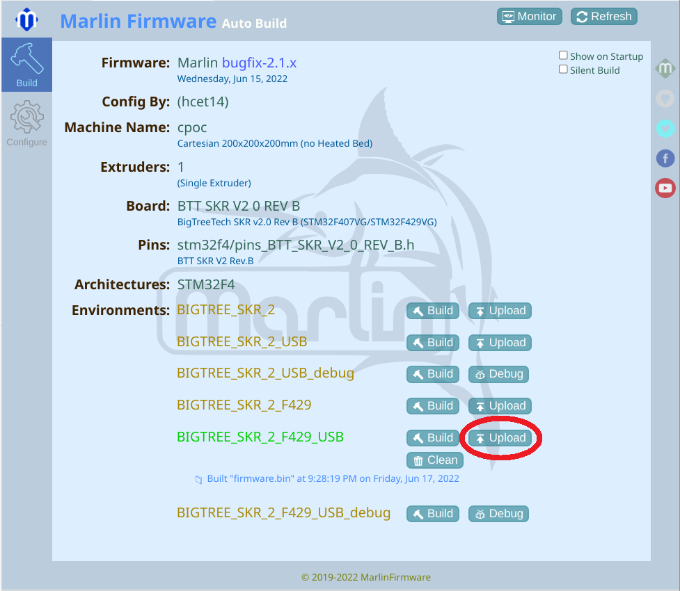

# auto_upload_marlin_skr2_stm32f429vtg6.py
Auto upload script for Auto Build Marlin to upload firmware.bin to Bigtreetech BTT SKR 2

This python script uploads the newly build firmware automatically to your SKR 2.

You don't need to upload the firmware to your SDcard and reset your SKR 2 anymore.

You just have to click in ABM panel here:

Follow the comments in the script.

Please let me know, if it works for you.

This can also easily taken for other boards running Marlin as a starting point.

ellensp gave me an example. Thanks a lot. I'm not a programmer!

If you want to contact me, please open an issue.
