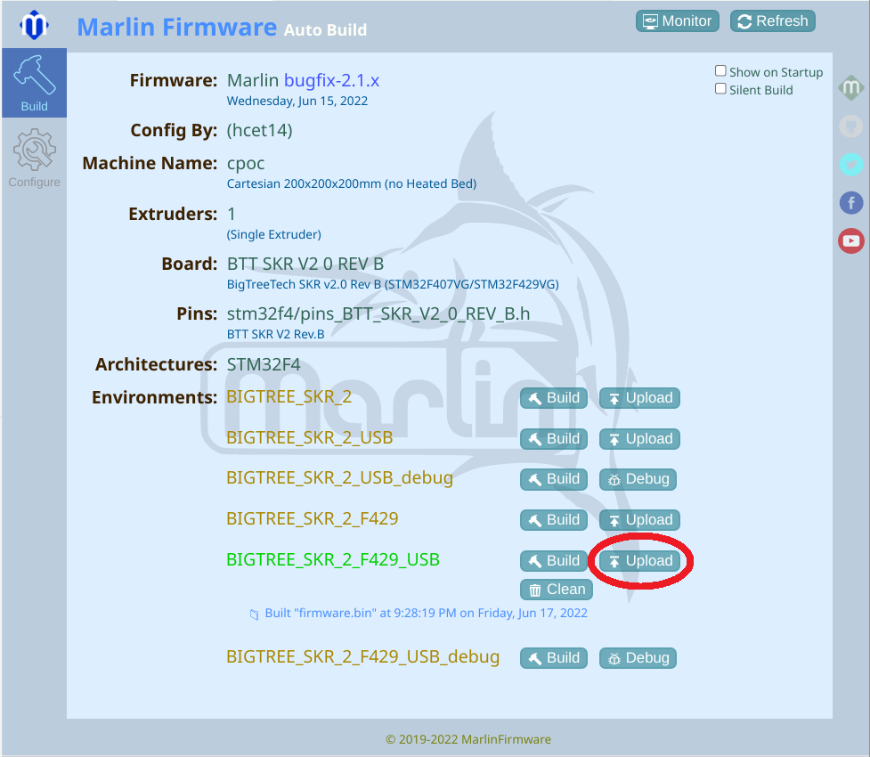

# auto_upload_marlin_skr2_stm32f429vtg6.py
Auto upload script for Marlin built with Auto Build Marlin for Bigtreetech BTT SKR 2 under Ubuntu

This python script uploads the newly build firmware automatically to your SKR 2.

You don't need to upload the firmware to your SDcard and reset your SKR 2 anymore.

You just have to click in ABM panel here:

